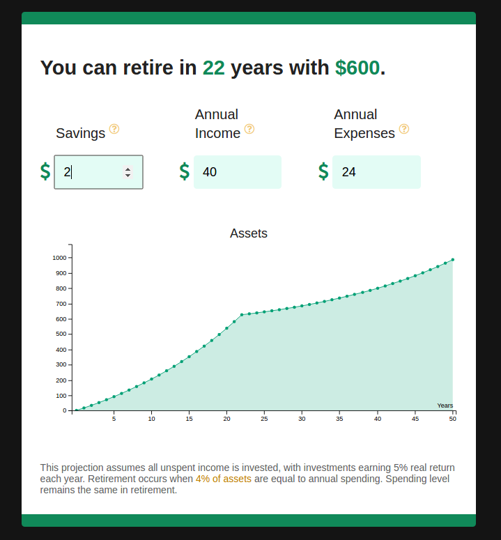

# Retirement Savings Calculator
___

JavaScript, jQuery, AngularJS, C3, CSS, SCSS

### GOAL:
This app is designed to be easy to use. The goal is to show the impact of reducing spending on retirement.

### ASSUMPTIONS:
- Assets grow by 5% each year
- Retirement can occur when expenses equal 4% of assets

### NEXT STEPS:

- Add logic to prevent the graph from displaying negative assets.
- Add logic to prevent users from entering negative numbers in annual income and annual expenses. - Display data labels assets as currency.

